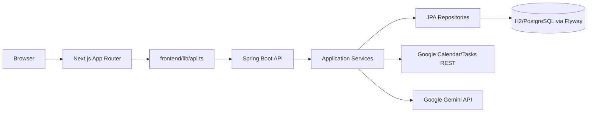
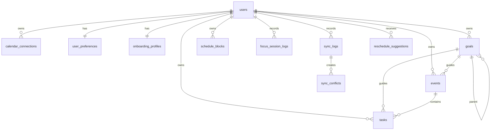
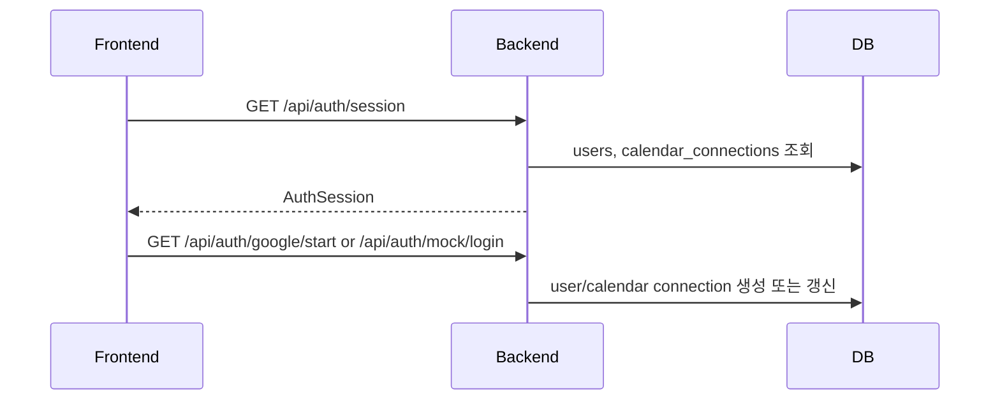
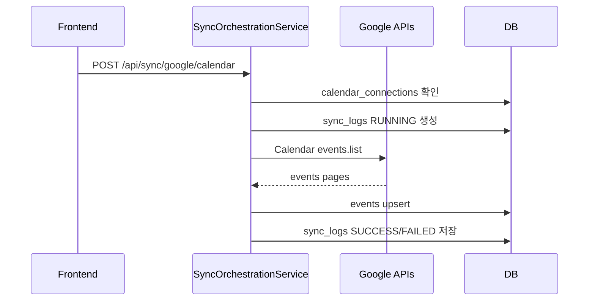
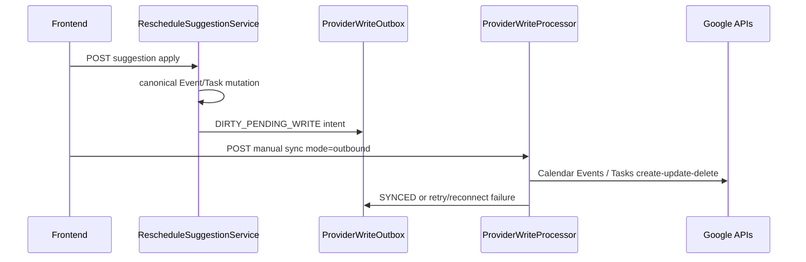

# Time Table Architecture Overview

Date: 2026-05-02

이 문서는 현재 `Time Table` 프로젝트의 DB, 백엔드, 프론트엔드 구조와 서로의 관계를 설명한다. 기준은 현재 코드베이스이며, Docker 패키징은 아직 의도적으로 보류된 상태다.

## 1. 시스템 한 줄 정의

`Time Table`은 사용자의 주간 루틴, 목표, 이벤트, 태스크, 집중 상태, Google Calendar/Tasks inbound sync, AI 재배치 제안을 하나의 실행 워크스페이스로 묶는 개인 일정 운영 도구다.

핵심 방향은 다음과 같다.

- DB가 사용자 상태의 canonical source다.
- 백엔드는 화면별로 필요한 조합 DTO를 만들어 프론트의 계산 부담을 줄인다.
- 프론트는 화면 상태, 요청, 사용자 조작을 담당하되 비즈니스 판정은 백엔드 DTO를 우선 사용한다.
- Google 연동은 inbound sync와 승인 후 provider write outbox 기반 write-back을 분리한다.

## 2. 전체 아키텍처



현재 실행 구성은 다음과 같다.

- Frontend: Next.js 16, React 19, TypeScript 6
- Backend: Spring Boot 3.5, Java 21, Spring Security, Spring Data JPA, Flyway
- DB: 기본 로컬 H2 file DB, 운영 전환 시 PostgreSQL 가능
- External API: Google OAuth, Google Calendar/Tasks inbound read, 승인 후 Calendar Events/Tasks write-back
- AI: Google Gemini API `generateContent` 기반 일정 정규화와 재배치 제안

## 2.1 Phase 0.5 Architecture Lock For Provider Write-back

2026-05-15 Ralph 실행에서 Google write-back 구현 전 아키텍처 락을 추가했다.
상세 결정은 `docs/architecture-lock-2026-05-15.md`를 기준으로 한다.

핵심 결정은 다음과 같다.

- `events`와 `tasks`가 사용자 데이터 변경의 canonical mutation model이다.
- `schedule_blocks`는 반복 주간 루틴과 호환 projection 레이어로 유지한다.
- `sync_mappings`가 provider identity, external id, etag, tombstone, mapping status의 소유자다.
- `events.external_source_id`, `tasks.external_source_id`와 etag 필드는 전환기 denormalized cache로만 둔다.
- `calendar_connections`는 Google granted scopes와 write capability를 저장해야 한다.
- 승인된 로컬/AI/focus 변경은 provider write outbox에 durable intent를 남기고, provider 호출은 커밋 이후 수행한다.
- Google imported item 수정은 기본적으로 mapping을 유지한 채 `DIRTY_PENDING_WRITE`가 되며, fork/detach는 사용자가 명시적으로 “Google과 분리된 로컬 복사본”을 선택할 때만 사용한다.

이 락은 기존 read-only inbound 구조를 보존하면서도 Google write-back 구현이 잘못된 local source of truth 위에 쌓이지 않도록 하는 실행 게이트다.

## 3. DB 아키텍처

마이그레이션은 `backend/src/main/resources/db/migration`에 있으며 Flyway가 실행 순서를 관리한다. Hibernate는 `ddl-auto=validate`라서 스키마 생성은 Flyway 책임이다.

### 3.1 Identity And Settings

| Table | 역할 | 주요 관계 |
| --- | --- | --- |
| `users` | 사용자 계정, 표시 이름, timezone, 기능 플래그 | 대부분 테이블의 루트 FK |
| `calendar_connections` | Google 연결 상태, access/refresh token, sync 에러 | `users`와 N:1, provider별 unique |
| `user_preferences` | 조용한 시간, 버퍼, 개입 빈도, 집중 선호값 | `users`와 1:1 |
| `onboarding_profiles` | 온보딩 답변과 완료 시각 | `users`와 1:1 |

`onboarding_profiles`는 온보딩 완료 여부의 canonical source다. 프론트의 `localStorage`는 온보딩 직후 첫날 안내 같은 handoff 보조 용도로만 사용한다.

### 3.2 Planning Core

| Table | 역할 | 주요 관계 |
| --- | --- | --- |
| `goals` | 장단기 목표, 진행률, 우선순위 | self parent, `events`/`tasks`에서 참조 |
| `schedule_blocks` | 반복 주간 루틴 블록 | 사용자별 요일/시간 단위 |
| `events` | 시간 범위가 있는 실행 항목 | `goals` optional, Google Calendar import 대상 |
| `tasks` | 마감일/예상 시간이 있는 작업 항목 | `goals` optional, `events` optional, Google Tasks import 대상 |

`schedule_blocks`는 반복 루틴이고, `events`와 `tasks`는 실제 실행 단위다. 포커스 화면은 이벤트/태스크를 우선 실행 항목으로 다루고, 현재/다음 schedule block은 컨텍스트로 붙인다.

### 3.3 Focus And Intervention

| Table | 역할 |
| --- | --- |
| `focus_sessions` | schedule block 기반 집중 세션 상태 |
| `focus_session_logs` | event/task 실행 완료, 연장, 미룸 로그 |
| `interventions` | 초과, 공백, 충돌, 목표 위험 등 개입 제안 |

현재 핵심 포커스 API는 `focus_session_logs`, `events`, `tasks`, `schedule_blocks`, `user_preferences`를 조합해 화면용 `FocusCurrentView`를 만든다.

### 3.4 Sync And AI Agent

| Table | 역할 |
| --- | --- |
| `sync_logs` | 수동, webhook, polling sync 실행 이력 |
| `sync_conflicts` | 외부 변경 알림과 로컬 판단이 충돌할 수 있는 경우의 기록 |
| `sync_mappings` | provider object와 local object 매핑용 모델 |
| `provider_write_outbox` | 승인된 Event/Task 변경을 Google에 반영하기 위한 durable write intent |
| `calendar_sync_runs` | 초기 calendar sync run 모델 |
| `reschedule_suggestions` | AI 재배치 제안, payload, 실행 snapshot |
| `chat_command_logs` | 자연어 명령 정규화 및 실행 결과 로그 |
| `priority_adjustment_proposals` | 우선순위 조정 제안 |

현재 Google inbound sync는 `sync_mappings`를 provider identity source로 갱신하면서 `events.external_source_id`, `tasks.external_source_id`, `external_etag`, `last_synced_at`을 전환기 denormalized cache로 같이 유지한다. Provider write-back intent는 `provider_write_outbox`가 소유하고, provider 성공 후 mapping/etag/cache를 같은 트랜잭션에서 갱신한다.

### 3.5 주요 관계 요약



## 4. 백엔드 아키텍처

백엔드는 기능 단위 package와 layer naming을 혼합해 사용한다.

```text
com.timetable.operator
  auth/
  dashboard/
  schedule/
  goals/
  events/
  tasks/
  focus/
  sync/
  agent/
  settings/
  common/
```

각 기능 package는 대체로 다음 구조를 따른다.

- `api`: REST controller
- `application`: use case service, 화면 DTO record
- `domain`: JPA entity, enum
- `infrastructure`: Spring Data repository, 외부 adapter

아직 완전히 분리된 hexagonal architecture는 아니다. DTO record가 service 내부에 있는 패턴이 많고, controller는 service record를 바로 반환하는 곳도 있다. 다만 기능별 경계는 비교적 분명하다.

### 4.1 공통 인프라

| Component | 역할 |
| --- | --- |
| `SecurityConfig` | 세션 기반 인증, CSRF, OAuth2 login, mock login 개발 경로 |
| `CurrentUserProvider` | 현재 인증 사용자를 `AppUser`로 해석 |
| `ApiResponses` / `ApiEnvelope` | envelope 응답 생성 |
| `AppProperties` | auth, calendar, schedule, AI 설정 binding |
| `WebClientConfig` | Google/AI 외부 HTTP 호출용 WebClient |
| `AuditableEntity` | 공통 `id`, `createdAt`, `updatedAt` |

응답 형식은 일부 혼재되어 있다. Dashboard, Focus, Goals, Tasks, Settings, Sync, Agent 계열은 envelope 기반이고, Auth, Onboarding, Schedule 일부는 DTO를 직접 반환한다. 프론트의 `requestRaw`와 `requestEnvelope`가 이 차이를 흡수한다.

### 4.2 주요 서비스 책임

| Service | 책임 |
| --- | --- |
| `AuthService` | 세션 응답, 기본/Google 사용자 생성, Google 연결 상태 노출 |
| `OnboardingService` | 온보딩 상태, 질문, 답변 저장, 기본 제안 생성/완료 |
| `ScheduleService` | 주간 루틴 조회, 기본 루틴 import, 블록 CRUD |
| `GoalService` | 목표 CRUD, 진행률 업데이트 |
| `TaskService` | 태스크 조회/생성/삭제/완료/스케줄링 |
| `EventService` | 이벤트 조회/생성/삭제/시작/완료/미룸/연장 |
| `FocusService` | 현재 집중 화면 DTO, 추천 태스크, 완료/미룸/초과 처리 |
| `DashboardService` | 대시보드 화면용 aggregate DTO 생성 |
| `SyncOrchestrationService` | Google Calendar/Tasks inbound/outbound sync 실행, capability 상태, conflict 기록 |
| `GoogleRestInboundSyncClient` | Google Calendar/Tasks REST 호출과 local upsert |
| `GoogleRestOutboundSyncClient` | Google Calendar Events/Tasks create/update/delete REST 호출 |
| `MockGoogleSyncClient` | `app.sync.google.mock-enabled=true` 로컬 검증에서 inbound/write-back을 외부 네트워크 없이 재현 |
| `ProviderWriteProcessor` | provider write outbox를 flush하고 mapping/etag/cache 상태 갱신 |
| `RescheduleSuggestionService` | AI 재배치 제안 생성, canonical Event/Task 또는 legacy ScheduleBlock 적용, 거절, 되돌리기 |

### 4.3 주요 API Surface

| Endpoint | 기능 | 프론트 사용처 |
| --- | --- | --- |
| `GET /api/auth/session` | 현재 세션과 Google 연결 상태 | `use-session-bootstrap` |
| `GET /api/auth/csrf` | 보호된 POST/PUT/DELETE용 CSRF 토큰 | `frontend/lib/api.ts` |
| `GET /api/auth/google/start` | Google OAuth 시작 URL | Login |
| `GET /api/auth/mock/login` | 개발용 mock login | E2E, local login |
| `GET /api/onboarding/status` | 온보딩 완료/질문/프로필 상태 | Onboarding guard |
| `POST /api/onboarding/bootstrap` | 초기 import/suggestion 준비 | Onboarding |
| `POST /api/onboarding/answers` | 생활 리듬과 집중 선호 저장 | Onboarding |
| `POST /api/onboarding/complete` | 온보딩 완료, 선택 시 제안 적용 | Onboarding |
| `GET /api/dashboard/summary` | 대시보드 aggregate | Dashboard |
| `GET /api/schedule/week` | 주간 반복 루틴 | Schedule, Dashboard |
| `POST /api/schedule/blocks` | 루틴 블록 생성 | Schedule |
| `PUT /api/schedule/blocks/{id}` | 루틴 블록 수정 | Schedule |
| `DELETE /api/schedule/blocks/{id}` | 루틴 블록 삭제 | Schedule |
| `GET /api/focus/current` | 현재 포커스, 스케줄 컨텍스트, 선호 컨텍스트 | Focus, Dashboard |
| `POST /api/focus/current/complete` | 현재 항목 완료 | Focus |
| `POST /api/focus/current/postpone` | 현재 항목 미룸 및 제안 요청 | Focus |
| `POST /api/focus/current/confirm-overrun` | 이벤트 초과 시간 처리 | Focus |
| `GET /api/sync/status` | Google sync 상태와 capability meta | Dashboard |
| `POST /api/sync/google/calendar` | Calendar inbound sync 또는 outbound outbox flush | Dashboard |
| `POST /api/sync/google/tasks` | Tasks inbound sync 또는 outbound outbox flush | Dashboard |
| `GET /api/agent/suggestions` | 현재 재배치 제안 목록 | Dashboard |
| `POST /api/agent/reschedule` | 수동 재배치 제안 생성 | Dashboard |
| `POST /api/agent/suggestions/{id}/apply` | 제안 적용 | Dashboard |
| `POST /api/agent/suggestions/{id}/reject` | 제안 거절 | Dashboard |
| `GET /api/settings` | 사용자 설정 조회 | 설정 연결용 |
| `PUT /api/settings` | 사용자 설정 저장 | 설정 연결용 |

## 5. 프론트엔드 아키텍처

프론트는 `frontend/app`의 Next.js App Router와 `frontend/components`의 client component 중심으로 구성된다.

```text
frontend/
  app/             route entry
  components/      화면/공통 UI
  hooks/           session, onboarding bootstrap
  stores/          zustand notice/session state
  lib/api.ts       backend API client
  lib/types.ts     backend DTO mirror
  lib/schedule.ts  schedule 화면 helper
  e2e/             Playwright scenario tests
```

### 5.1 Route And View 구조

| Route | Component | 역할 |
| --- | --- | --- |
| `/login` | `LoginView` | Google/mock login 시작 |
| `/auth/callback` | `AuthCallbackView` | OAuth callback 후 작업공간 이동 |
| `/onboarding` | `OnboardingView` | 초기 질문, preview, 완료 |
| `/dashboard` | `DashboardView` | 목표, 주간 모양, focus, sync, suggestion 통합 |
| `/schedule` | `ScheduleView` | 주간 루틴 CRUD |
| `/focus` | `FocusView` | 현재 집중 실행, 미룸/완료/연장 |

`AppShell`은 보호된 화면의 공통 shell이다. 세션을 먼저 확인하고, 온보딩이 끝나지 않았으면 `/onboarding`으로 보낸다.

### 5.2 API Client

`frontend/lib/api.ts`가 백엔드 연결의 단일 진입점이다.

- `NEXT_PUBLIC_API_BASE_URL`을 사용하고 기본값은 `http://localhost:8080`이다.
- 모든 요청은 `credentials: "include"`를 사용해 세션 쿠키를 보낸다.
- GET이 아닌 요청은 `/api/auth/csrf`에서 받은 CSRF header를 붙인다.
- 403 CSRF 실패는 토큰을 한 번 갱신해 재시도한다.
- envelope 응답과 raw DTO 응답을 구분해 처리한다.

`frontend/lib/types.ts`는 백엔드 DTO를 TypeScript interface로 복제한다. 백엔드 record 변경 시 이 파일을 같이 갱신해야 프론트 타입 안정성이 유지된다.

### 5.3 UI State

| 파일 | 역할 |
| --- | --- |
| `use-session-bootstrap.ts` | 앱 진입 시 `/api/auth/session` 확인 |
| `use-onboarding-bootstrap.ts` | 온보딩 상태 확인 및 guard |
| `stores/app-store.ts` | notice, session cache 등 가벼운 클라이언트 상태 |
| `onboarding-day-handoff.ts` | 온보딩 직후 첫날 안내용 localStorage |

중요한 사용자 상태는 DB에 저장하고, 프론트 store/localStorage는 화면 전환과 알림 보조에만 둔다.

## 6. 기능별 데이터 흐름

### 6.1 Login And Session



세션은 Spring Security 기반이다. 프론트는 세션 쿠키를 직접 해석하지 않고 `/api/auth/session` 응답을 기준으로 화면 guard를 결정한다.

### 6.2 Onboarding

```mermaid
flowchart TD
    Status[GET onboarding/status] --> Need{completed?}
    Need -- no --> Bootstrap[POST onboarding/bootstrap]
    Bootstrap --> Answers[POST onboarding/answers]
    Answers --> Profile[(onboarding_profiles)]
    Answers --> Preferences[(user_preferences)]
    Answers --> Suggestion[(reschedule_suggestions)]
    Suggestion --> Complete[POST onboarding/complete]
    Complete --> Dashboard[/dashboard]
```

온보딩 답변은 생활 리듬과 집중 선호로 나뉜다. 생활 리듬은 `onboarding_profiles`, 집중 실행 기준은 `onboarding_profiles`와 `user_preferences`에 같이 반영된다.

### 6.3 Dashboard

`GET /api/dashboard/summary`는 다음 응답을 한 번에 묶는다.

- `week`: 주간 루틴
- `goals`: 목표 목록
- `focus`: 현재 집중 상태
- `sync`: Google sync 상태와 capability meta
- `suggestions`: AI 재배치 제안
- `metrics`: 평균 목표 진행률, 주간 구성 점수, 성장 블록 수, top goal

이 설계 덕분에 프론트 대시보드는 여러 API 응답을 조합하지 않고 화면 구성에 집중한다.

### 6.4 Schedule

Schedule은 반복 루틴 레이어다.

- 초기 주간 루틴 fixture는 운영 사용자에게 자동 생성하지 않는다.
- 사용자는 schedule block을 직접 생성, 수정, 삭제한다.
- schedule block은 focus 화면에서 현재/다음 시간대 컨텍스트로 사용된다.

현재 schedule block 자체가 곧 실행 항목은 아니다. 실행과 완료의 중심은 `events`와 `tasks`다.

### 6.5 Focus

Focus는 다음 데이터를 조합한다.

- 현재/다음 `events`
- 추천 `tasks`
- 현재/다음 `schedule_blocks`
- `user_preferences`의 집중 시간, 휴식 버퍼, 개입 강도
- active `reschedule_suggestions`

응답의 핵심은 `FocusCurrentView`다.

- `focusState`: 현재 상태
- `currentItem`: 지금 실행할 event/task
- `nextItem`: 다음 실행 항목
- `scheduleContext`: 현재/다음 루틴 블록
- `preferenceContext`: 집중 선호 기반 guidance
- `recommendedTasks`: 아직 이벤트에 묶이지 않은 추천 태스크

### 6.6 Google Inbound Sync



Google Tasks도 같은 형태이며, 먼저 task list를 읽고 각 list의 tasks를 읽는다.

현재 sync capability는 다음과 같다.

- `adapterMode`: `read_only` 또는 `read_write`
- `externalReadEnabled`: `true`
- `externalWriteEnabled`: 저장된 Google granted scope/capability 기준
- `calendarWriteEnabled`, `tasksWriteEnabled`, `capabilityStatus`, `pendingProviderWriteCount`, provider-write pending/retry/reconnect/conflict 세부 count를 `/api/sync/status`와 dashboard에서 노출한다.
- Calendar: `events.list` range filter, pagination, cancelled item detach
- Tasks: `tasklists.list`, `tasks.list`, due range filter, deleted item detach
- 변경 없음: `external_etag`가 같고 local sync state가 `IMPORTED`면 저장하지 않는다.
- token refresh: 아직 자동화하지 않았고, 만료 시 connection을 `DEGRADED`로 표시한다.

### 6.7 Google Provider Write-back



승인된 local/manual/focus/AI 변경은 먼저 로컬 DB에 커밋되고, Google 호출은 outbox flush에서 수행한다. 이 구조는 provider 실패가 사용자의 승인된 로컬 변경을 롤백하지 않도록 하며, dashboard는 `pendingProviderWriteCount`와 capability label로 대기/재연결 상태를 보여준다.

### 6.8 AI Reschedule Suggestions

AI 재배치 흐름은 아직 user-confirmed UX다.

1. 사용자가 수동 요청하거나 focus postpone이 발생한다.
2. `RescheduleSuggestionService`가 structured command batch를 만든다.
3. `reschedule_suggestions`에 payload와 상태를 저장한다.
4. 프론트는 preview, executable 여부, 적용/거절 액션을 보여준다.
5. 사용자가 적용하면 백엔드가 실행 가능한 command만 반영하고 execution summary를 남긴다.

2026-05-15 이후 `target_type=event` 명령은 먼저 canonical `events`를 찾고, 없으면 legacy `schedule_blocks` 호환 경로로 fallback한다. `target_type=task` 명령은 canonical `tasks`를 수정하며 provider write outbox를 예약한다.

반복 승인 기반 auto-apply는 아직 열지 않았다.

## 7. 중요한 설계 규칙

- DB migration이 먼저다. entity 필드를 추가하면 Flyway migration과 테스트를 함께 추가한다.
- 화면 전용 파생값은 가능하면 backend DTO로 내린다.
- 프론트는 `lib/types.ts`를 백엔드 record 변경과 함께 갱신한다.
- 외부 provider 변경은 hard delete하지 않고 detach/cancel 상태로 보존한다.
- provider item의 일반 local edit는 같은 Event/Task row와 mapping을 유지하고 `DIRTY_PENDING_WRITE`로 전환한다.
- fork/detach는 사용자가 명시적으로 Google과 분리된 로컬 복사본을 선택하는 고급 경로로 제한한다.
- Google write-back은 approval-first outbox 경로로만 수행한다.

## 8. 현재 한계와 다음 작업

| 영역 | 현재 상태 | 다음 작업 |
| --- | --- | --- |
| Docker/CI | 의도적으로 보류 | packaging 단계에서 backend/frontend/E2E wrapper 작성 |
| Google sync | inbound + write-capable scopes + provider write outbox foundation | token refresh, reconnect UX, mocked write-back E2E, conflict review UX |
| Conflict UI | DB record와 resolve API 존재 | 사용자 친화적인 conflict review 화면 필요 |
| API 응답 형식 | envelope와 raw DTO 혼재 | 신규 API는 envelope로 통일 권장 |
| Settings UI | backend contract 존재 | 프론트 설정 화면을 별도 노출 가능 |
| AI 재배치 | proposal/apply가 canonical Event/Task와 legacy ScheduleBlock 경로를 지원 | 설명 품질, command coverage, revert의 provider side-effect 강화 |

## 9. 개발 실행 명령

```powershell
cd D:\Time_table\backend
.\gradlew.bat bootRun
```

```powershell
cd D:\Time_table\frontend
npm run dev
```

```powershell
cd D:\Time_table\backend
.\gradlew.bat test
```

```powershell
cd D:\Time_table\frontend
npm run typecheck
npm run build
npx playwright test --list
```

라이브 E2E는 backend와 frontend dev server가 떠 있어야 한다.
